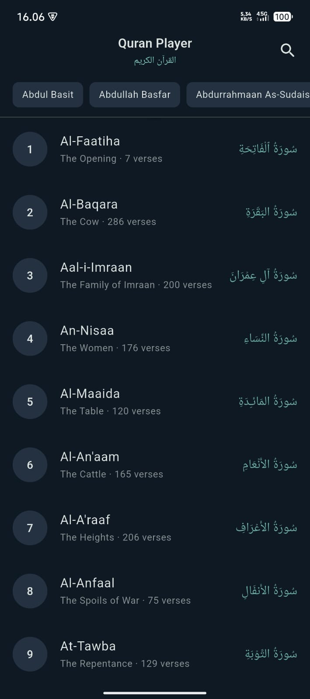
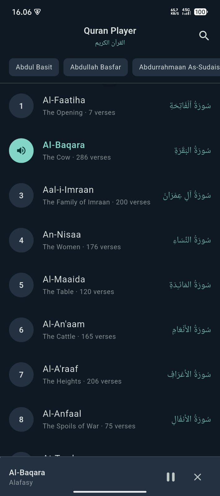
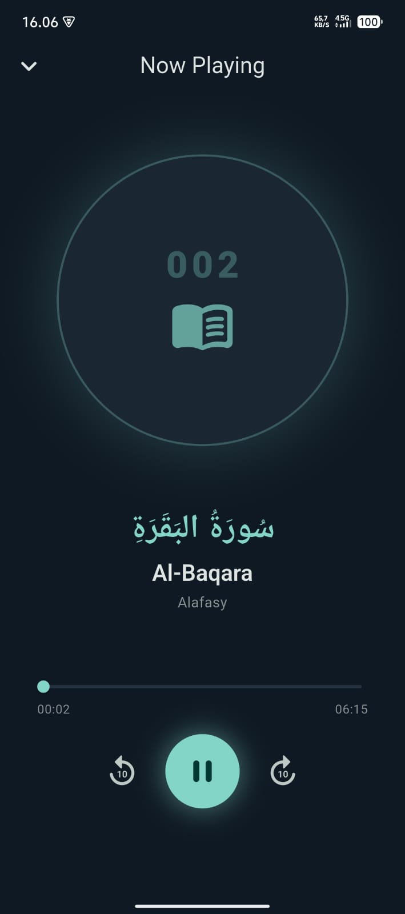
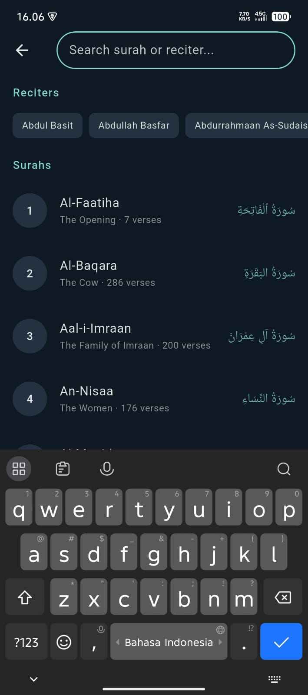

# 📖 Quran Player

A mobile Quran audio player built with Flutter, featuring surah browsing, reciter selection, audio playback controls, and search functionality.

---

## 📱 Screenshots

<p align="center">
  
</p>

### 📸 Application Interface

|                            Home Screen                             |                                        Home with Mini Player                                         |
|:------------------------------------------------------------------:|:----------------------------------------------------------------------------------------------------:|
|  |  |

|                             Player Screen                              |                             Search Screen                              |
|:----------------------------------------------------------------------:|:----------------------------------------------------------------------:|
|  |  |

---

## ✨ Features

| Feature | Description |
|---|---|
| **Surah List** | Browse all 114 surahs with Arabic names, English transliteration, and verse count |
| **Reciter Selection** | Choose from multiple reciters (qaris) via a horizontal chip selector |
| **Search** | Search surahs by English name, meaning, or number — and reciters by name |
| **Audio Playback** | Play, pause, resume with dedicated controls |
| **Progress Bar** | Real-time progress display with total/current duration |
| **Seeking** | Drag the slider to jump to any position in the audio |
| **Rewind / Fast Forward** | Skip ±10 seconds with dedicated buttons |
| **Mini Player** | Persistent mini player bar on home screen while audio plays |
| **Dark Theme** | Deep teal Material 3 dark theme with warm gold accents |

---

## 🏗️ Architecture

The project follows a **layered clean architecture** with clear separation of concerns:

```
lib/
├── core/
│   ├── bindings/       # InitialBinding — global singletons
│   ├── network/        # DioClient — configured HTTP client
│   ├── routes/         # AppPages, Routes — named route definitions
│   ├── theme/          # AppTheme — Material 3 light & dark themes
│   └── utils/          # AppUtils — formatting helpers
│
├── data/
│   ├── model/         # Surah, Reciter, Track
│   ├── repository/   # QuranRepository — API data access layer
│   └── service/       # AudioService — just_audio wrapper with reactive state
│
└── presentation/
    ├── screens/
    │   ├── home/       # HomeScreen + HomeController + HomeBinding
    │   ├── player/     # PlayerScreen + PlayerController + PlayerBinding
    │   └── search/     # SurahReciterSearchScreen + SurahReciterSearchController + SurahReciterSearchBinding
    └── widgets/        # Shared reusable UI components
```

### Data Flow

```
Screen (View) → Controller (GetxController) → Service/Repository → API / AudioPlayer
                     ↑                              |
                Rx observables  ←──────────── emit reactive state
```

---

## 🔧 Tech Stack

| Layer | Technology |
|---|---|
| Framework | Flutter 3.22+ |
| State Management | GetX 4.6 |
| HTTP Client | Dio 5.x |
| Audio Playback | just_audio 0.9.x |
| Audio Session | audio_session 0.1.x |
| Loading Skeleton | shimmer 3.x |
| Code Generation | json_serializable 6.11.0 |
| Annotations | json_annotation 4.9.0 |
| UI | Material Design 3 |

---

## 🌐 API

This app consumes the **[AlQuran.cloud API](https://alquran.cloud/api)** — a free, open Quran API.

| Endpoint | Purpose |
|---|---|
| `GET /v1/surah` | Fetch all 114 surahs |
| `GET /v1/edition?format=audio&language=ar` | Fetch all audio reciters |

Audio files are streamed from the **Islamic Network CDN**:
```
https://cdn.islamic.network/quran/audio-surah/128/{edition}/{surah}.mp3
```

---

## 🚀 Getting Started

### Prerequisites

- Flutter `>=3.22.0`
- Dart `>=3.4.0`
- Android SDK 21+ / iOS 12+

### Installation

```bash
# Clone the repository
git clone https://github.com/your-username/quran_player.git
cd quran_player

# Install dependencies
flutter pub get

# Run on a connected device or emulator
flutter run
```

### Build

```bash
# Android APK
flutter build apk --debug

# iOS (requires macOS + Xcode)
flutter build ios --debug
```

---

## 📂 Project Structure Notes

- **`InitialBinding`** registers `DioClient`, `QuranRepository`, and `AudioService` as permanent singletons on app startup.
- **`AudioService`** is a `GetxService` that wraps `just_audio` and exposes reactive `Rx` observables — controllers never interact with `just_audio` directly.
- **`TrackModel`** is a pure value object combining a `SurahModel` + `ReciterModel`, and computes the CDN audio URL on the fly.
- **`PlayerController`** decouples the seek slider from live position using an `isSeeking` flag to prevent jitter during drag.

---

## 🧪 Testing

```bash
# Run all tests
flutter test

# Run with coverage
flutter test --coverage
```

> Unit tests cover: `AppUtils`, `SurahModel.fromJson`, `ReciterModel.fromJson`, `TrackModel.audioUrl`

---

## 📄 License

This project is submitted as a technical assessment. All Quran data is sourced from [AlQuran.cloud](https://alquran.cloud) under their open API terms.
